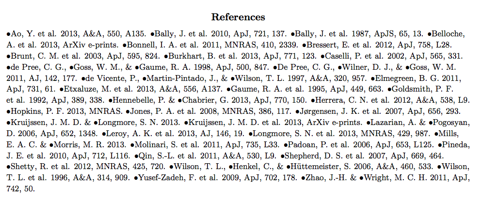

Making a REALLY compact bibliography
====================================

Tool for making an ApJ-style bibliography (e.g. using natbib so you can use \citep) in a really compact form, e.g.::

   Blah et al 2010 * Foo et al 1920 * Bar et al 1888

instead of::

   Blah et al 2010 
   Foo et al 1920 
   Bar et al 1888

Instructions
------------

Include `bib_macros.tex`_ in your header, e.g.::

    \include{bib_macros}

or::

    \input{bib_macros}

REFERENCES
----------

 * https://tex.stackexchange.com/questions/5571/reduce-bibliography-to-one-line
 * http://www.ctex.org/documents/packages/table/paralist.pdf

.. _bib_macros.tex: bib_macros.tex
